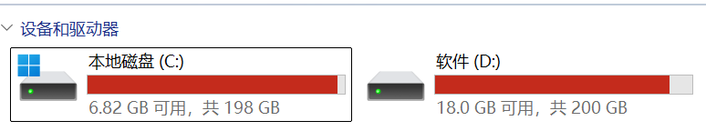

# 智净大师 (Wisweep) — 任意路径智能文件清理系统

> 不替用户做决定，而是把清理的决策权完整交还给用户。

[](LICENSE)


---

## 开场白
你有过磁盘红色预警的恐惧吗？那就来试试【智净大师】吧！


## 项目简介

传统电脑管家类软件的文件清理功能几乎都锁定在 C 盘，而用户真正的痛点往往在 D 盘、E 盘甚至外接硬盘中——开发者的 `node_modules`、设计师的素材缓存、普通用户堆了数年的下载目录。

**智净大师** 让你指定**任意路径**进行扫描，基于智能引擎识别出可清理文件，以清晰列表呈现。**所有清理项默认不勾选**，由你逐项确认后再执行——你看到的是什么，删掉的就是什么。

### 核心特性

- **任意路径扫描** — 支持任意磁盘、任意文件夹，包括外接硬盘和 U 盘
- **智能分类推荐** — 基于规则的引擎自动识别临时文件、缓存、日志、构建产物等
- **空文件夹检测** — 独立扫描空目录结构，支持递归合并建议
- **透明确认机制** — 所有清理项默认不勾选，人工二次确认
- **多种清理模式** — 回收站（可恢复）、永久删除、安全擦除（覆写后删除）
- **文件定位** — 一键打开文件所在文件夹并高亮选中

---

## 快速开始

### 前置条件

| 工具 | 版本要求 | 安装方式 |
|------|----------|----------|
| Node.js | >= 20 (推荐 24) | [nodejs.org](https://nodejs.org/) |
| pnpm | >= 9 | `npm install -g pnpm` |
| Rust | stable | [rustup.rs](https://rustup.rs/) |
| Windows SDK | — | Visual Studio Build Tools 或 Visual Studio 2022 |

### 一键启动（推荐）

```powershell
# Windows PowerShell，进入 wisweep 目录后运行
cd wisweep
.\scripts\dev.ps1
```

### 手动启动

```powershell
# 1. 进入项目目录
cd wisweep

# 2. 安装依赖
pnpm install

# 3. 启动开发服务器（前端 + Tauri 窗口）
pnpm tauri dev
```

首次启动会下载 Rust 依赖并编译后端，耗时约 2-5 分钟。

---

## 脚本说明

所有脚本位于 `wisweep/scripts/` 目录，需在 PowerShell 中运行。

| 脚本 | 用途 | 命令 |
|------|------|------|
| `scripts/dev.ps1` | 一键启动开发环境（含依赖检查） | `.\scripts\dev.ps1` |
| `scripts/build.ps1` | 构建项目（支持 --release） | `.\scripts\build.ps1 --release` |
| `scripts/package.ps1` | 完整发布打包（清旧产物 + 构建 + MSI/NSIS） | `.\scripts\package.ps1` |
| `scripts/ci-build.ps1` | CI/CD 环境构建（检查 + 打包） | `.\scripts\ci-build.ps1` |

### PowerShell 脚本参数

```powershell
# build.ps1 参数
.\scripts\build.ps1 [-Release] [-Targets <msi|nsis|all>]

# 示例：只打包 NSIS 安装程序
.\scripts\build.ps1 -Release -Targets nsis
```

### 也可通过 pnpm 调用（工作目录必须为 wisweep/）

```bash
pnpm scripts:dev          # 启动开发（内部调用 dev.ps1）
pnpm scripts:build        # 构建（内部调用 build.ps1）
pnpm scripts:package      # 打包发布（内部调用 package.ps1）
pnpm scripts:ci           # CI 构建（内部调用 ci-build.ps1）
pnpm build                # 仅构建前端
pnpm build:tauri          # 构建前端 + Tauri（Debug）
pnpm build:release        # 构建前端 + Tauri（Release）
```

---

## 构建与打包

> 所有命令需在 `wisweep/` 目录下执行。

### 开发构建

```bash
pnpm build:tauri
# 产物: wisweep/src-tauri/target/debug/wisweep.exe
```

### 发布构建

> Tauri v2 的 `build` 命令默认就是 Release 模式，无需额外参数。

```bash
# 打包为安装程序（MSI + NSIS）
pnpm build:release

# 或只打包 NSIS（跳过 MSI）
npm run build:release -- --bundles nsis
```

> 注意：发布构建前请确保前端 `wisweep/dist/` 已存在，或先运行 `pnpm build`。

发布产物位于 `wisweep/src-tauri/target/release/bundle/`：

```
bundle/
├── msi/智净大师_0.1.0_x64_zh-CN.msi
└── nsis/智净大师_0.1.0_x64-setup.exe
```

### 仅构建前端

```bash
pnpm build
# 产物: wisweep/dist/ (Vite 静态文件)
```

---

## 架构概览

```
用户界面 (React 19 + TypeScript)
    │ Tauri IPC
    ▼
业务逻辑层 ──→ 核心引擎层 ──→ 基础设施层
(Rust)          (Rust)         (Rust + OS API)
```

详细架构文档请参见 [specs/architecture.md](wisweep/specs/architecture.md)。

---

## 用户操作指南

### 1. 选择路径

- **手动输入**：在输入框中直接键入路径（多个路径用 `;` 分隔）
- **浏览选择**：点击"浏览"按钮使用系统文件夹选择器
- **收藏路径**：点击左侧收藏列表快速切换

### 2. 扫描配置

- **递归扫描子目录**：是否包含子文件夹（默认开启）
- **包含隐藏文件**：是否扫描隐藏文件和系统文件
- **最小文件大小**：低于此大小的碎片文件被忽略（默认 1KB）

### 3. 查看结果

扫描完成后，结果按分类分组展示：


### 4. 文件操作

| 操作 | 方式 | 说明 |
|------|------|------|
| 勾选/取消 | 点击复选框 | 默认全部不勾选 |
| 全选/全不选 | 顶部操作栏按钮 | — |
| 打开文件位置 | 点击行尾图标 | 在资源管理器中定位文件 |
| 查看属性 | 右键菜单（规划中） | — |

### 5. 清理模式

| 模式 | 说明 | 可恢复 |
|------|------|--------|
| 移至回收站 | 文件移至系统回收站（默认） | ✅ |
| 永久删除 | 跳过回收站直接删除 | ❌ |
| 安全擦除 | 随机覆写后删除，防恢复 | ❌ (不可恢复) |

---

## 开发指南

### 项目结构

```
wisweep/
├── src/                    # 前端 (React)
│   ├── components/         # UI 组件
│   ├── stores/             # Zustand 状态
│   ├── types/              # TS 类型
│   └── utils/              # 工具函数
├── src-tauri/src/          # 后端 (Rust)
│   ├── scanner/            # 文件扫描
│   ├── classifier/         # 分类引擎
│   ├── cleaner/            # 清理执行
│   ├── database/           # SQLite 持久化
│   ├── models/             # 数据模型
│   └── utils/              # 平台工具
└── specs/                  # 设计文档
```

### 关键命令

> 所有命令需在 `wisweep/` 目录下执行。

```bash
# TypeScript 类型检查
pnpm tsc --noEmit

# 仅启动前端（不启动 Tauri 窗口）
pnpm dev

# Rust 代码检查（完整路径）
cd wisweep/src-tauri && cargo check

# 清理构建产物
pnpm clean
```

### 技术栈速览

- **前端**：React 19 + TypeScript + Vite 7 + Zustand 5
- **后端**：Rust (edition 2021) + jwalk (文件遍历) + rusqlite (SQLite)
- **IPC**：Tauri invoke + event 通信
- **桌面**：Tauri v2 (Windows/macOS/Linux)

---

## 许可

本项目基于 MIT 许可开源。

---

## 相关文档

- [架构设计文档](wisweep/specs/architecture.md) — 详细技术架构
- [设计文档](设计文档.md) — 需求规格与概要设计
- [README.en.md](README.en.md) — English version
